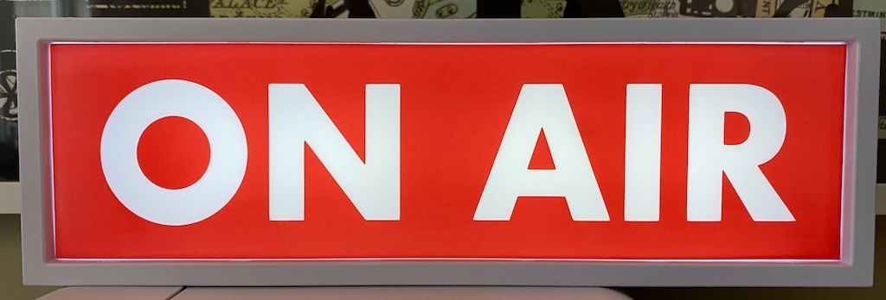
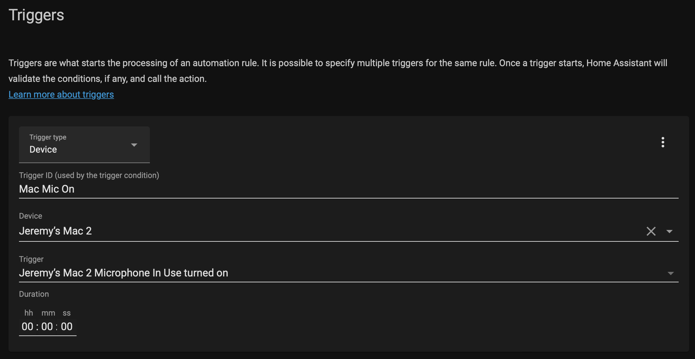
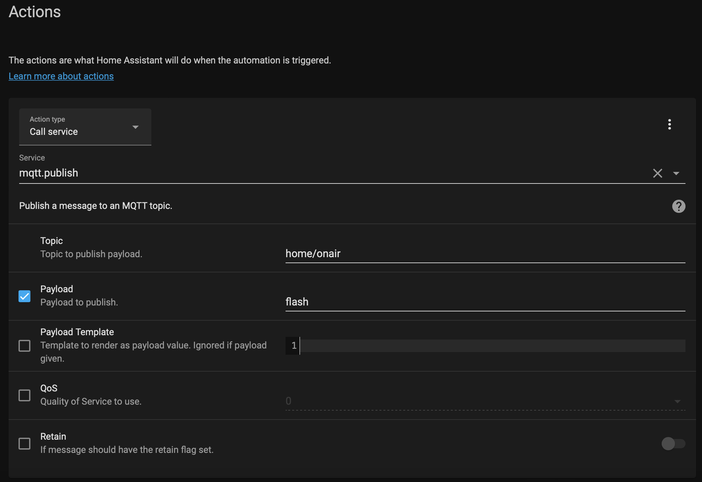
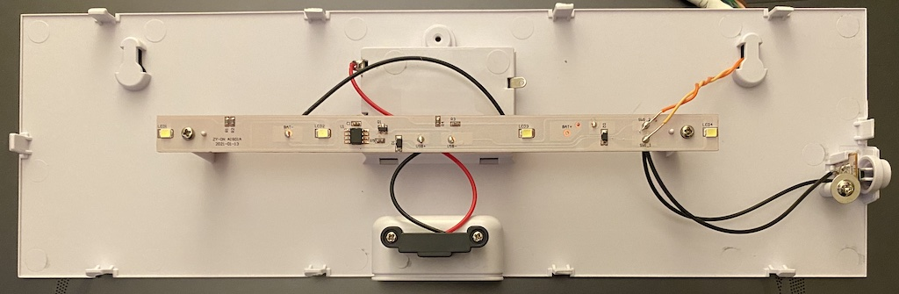
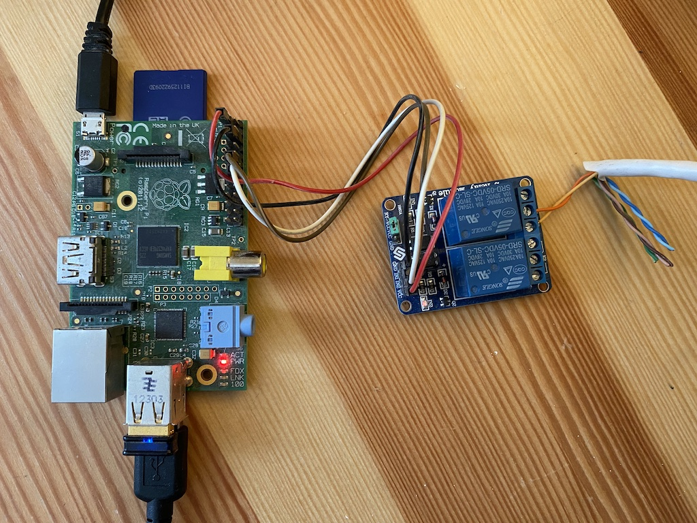

# On air light

This project was to make an On Air light that would automatically come on whenever I'm in a meeting or call on my Mac. This was achieved using [Home Assistant](https://www.home-assistant.io/), [Home Assistant Companion for Mac](https://apps.apple.com/us/app/home-assistant/id1099568401), [Mosquitto](https://mosquitto.org/), [Raspberry Pi](https://www.raspberrypi.com/), [2 Relay Module](https://www.sunfounder.com/products/2channel-relay-module) and an [On Air light](https://firebox.com/products/on-air-light).

## Setup
Home Assistant, the Home Assistant companion and Mosquitto all need to be installed and configured to connect together. In my case I installed everything on my Mac but it's probably more common to have Home Assistant and Mosquitto co-hosted on another server. The Home Assistant companion is installed from the App Store. It adds your Mac as a Device and within it are sensors for various things including the microphone. This allows you to make automations for when the microphone is active/inactive.

In this automation the "Microphone In Use turned on" trigger is used with an MQTT action to simply publish a payload to a topic:

We're sending "flash" to the "home/onair" topic.

## Wiring
The On Air light has a button which cycles through three states: ON, FLASH and OFF. I took it apart and found that it's a simple button that when pressed completes a circuit. Each momentary press/release makes and breaks the circuit. This meant it was pretty easy to achieve this same action with a GPI controlled relay. The orange and yellow wires go from the switch points to the relay module. This is wired up to the Raspberry Pi.

## Code
The `onair.py` script uses two simple libraries to control the GPIO and to work with MQTT: [RPi.GPIO](https://pypi.org/project/RPi.GPIO/) and [paho-mqtt](https://pypi.org/project/paho-mqtt/). It uses the payload received on the topic to advance the on air light's state from whatever it currently is to the desired state. As there are three states: ON, FLASH and OFF, this could mean two "button presses" - to get to OFF from ON you have to go through FLASH.

## That's it!
When I start a call in Teams, Zoom, Chime... etc. the "Microphone In Use turned on" trigger fires the "home/onair:FLASH" MQTT message. The Raspberry Pi receives this, advances the state to FLASH which triggers the relay and sets the On Air light flashing. When the call is over the "Microphone In Use turned off" trigger is used to set the On Air light to OFF.
